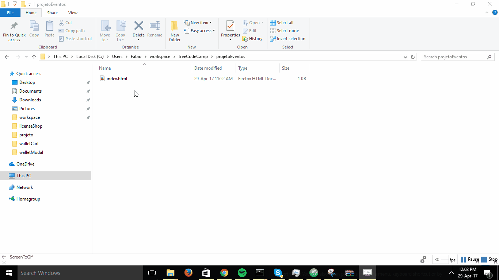

## Programas necessários.

Para iniciar o desenvolvimento web nós vamos utilizar 2 coisas:

* Um navegador - [O chrome](https://www.google.com/chrome/browser/desktop/);
* Um editor - [O atom](https://atom.io/);

Instale-os na sua máquina e vamos estar prontos para começar.

## Criando a estrutura do projeto.

Desenvolvimento web é basicamente a criação de arquivos que vão ser utilziado no navegador.

Após instalar o Atom você verá a página de boas vindas que é parecida com essa:

![Página de boas vindas do atom][welcome]

[welcome]: welcome.png "Página de boas vindas"

Há diversos guias utéis e eu sugiro explorá-los e entendê-los no futuro, mas por hora vamos apenas criar um novo projeto, esse projeto.

Clique no **OpenProject** no menu de boas vindas, vai aparecer um botão que vai abrir uma janela do explorador de arquivos. Salve em algum lugar uma pasta com o nome **projetoEventos** por exemplo.

Todo o desenvolvimento desta etapa vai ser feito nesta pasta, que chamaremos de **pasta do projeto**.

![Criação do projeto][openProject]

[openProject]: openProject.png "Criação do projeto".

A partir deste momento vamos começar o desenvolvimento em sí.

Você deve ter aberto uma pasta na parte esquerda, essa é a pasta do seu projeto (1 na imagem abaixo). Você pode fechar as abas 2 e 3 clicando no X.

![Inicio do projeto][starting]

[starting]: starting.png "Inicio do projeto".

## Criando o primeiro arquivos

Na pasta com o nome que você criou **projetoEventos** na direita, clique com o botão direito do mouse e crie um novo arquivo ("new file") crie um arquivo com o nome de **index.html**.

Você verá um novo arquivo aparecer na área do projeto , dentro da pasta e um arquivo aparecern o editor. É nesse área do editor com a aba com o título do nome do arquivo que você vai poder escrever no arquivo correspondente.


[newFile]: (newFile.gif) "Primeiro arquivo".

Agora dentro do recém criado arquivo index.html digite a palavra "html", um símbolo deve aparecer.

![Auto complete][autoComplete]

[autoComplete]: autoComplete.png "Auto complete".

Esse símbolo indica uma sugestão para completar um código. Aperte "tab" ou "enter" e ele automaticamnte preencherá diversas palavras para você acelerando seu desenvolvimento.


[autoCompleted]: (autoCompleted.gif) "Completando o código".

Dentro da parte escrito body digite "<h1>Hello World</h1>" e salve o arquivo (ctrl + s).

Seu código no index.html deve estar da seguinte forma agora:

```html
<!DOCTYPE html>
<html>
  <head>
    <meta charset="utf-8">
    <title></title>
  </head>
  <body>
    <h1>Hello World</h1>
  </body>
</html>
```

## Visualizando o seu trabalho.

Abra o explorador de arquivos (onde você navega nas suas pastas), e procure o seu arquivo que está na pasta "projetoEventos", abra-o no chrome.

Você deve ver algo assim:



[openInChrome]: (openInChrome.gif) "Visualizando o arquivo".

Parabéns você já está começando a desenvolver!.
